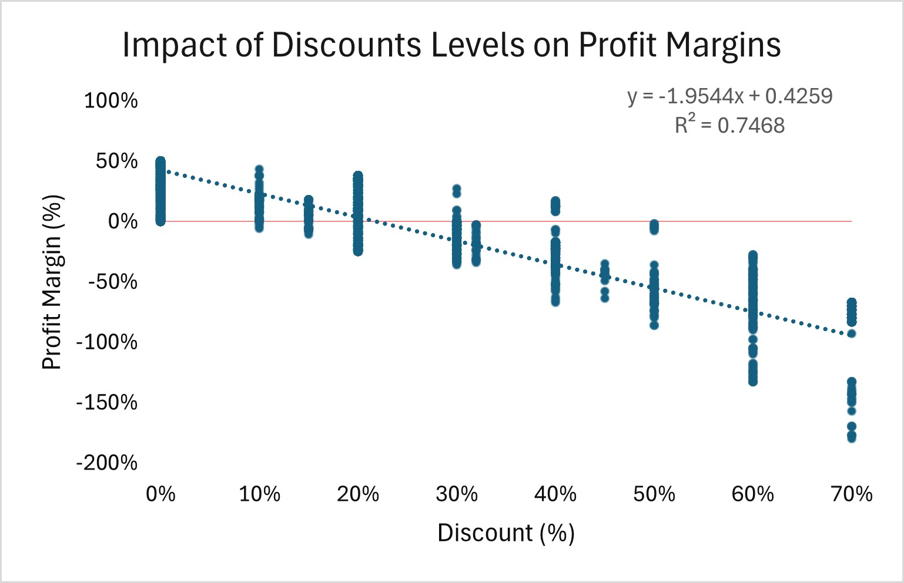
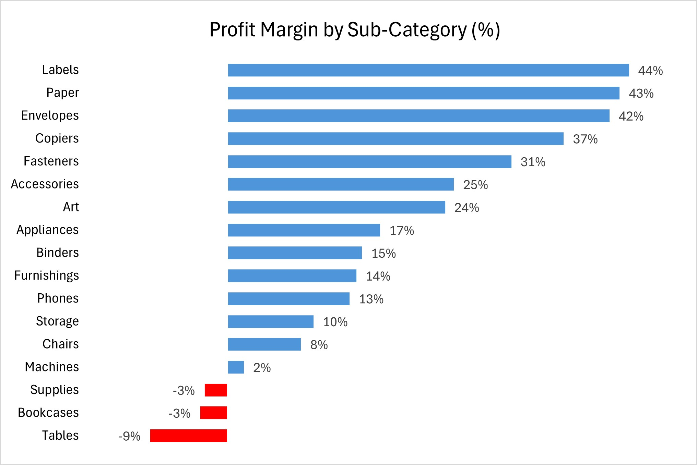
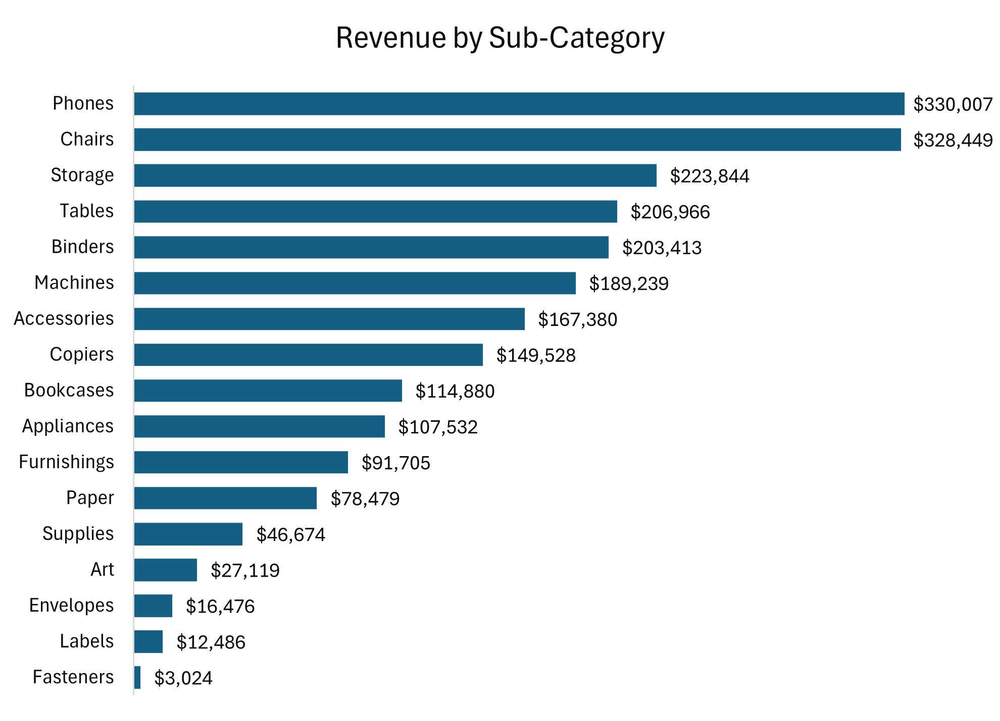

# Superstore Profitability Analysis

## Overview
This project analyzes a retail dataset of ~9,000 transactions to identify key drivers of profitability across regions, product categories, and discount levels.

The goal was to move beyond revenue metrics and uncover factors that impact profit margins and business performance.

## Key Insights

- Profitability generally declines as discounts increase; margins approach 0% around ~22% on average, though the relationship varies by product category.
- Several high-revenue product categories (e.g., Tables, Bookcases) generate negative profit, highlighting inefficiencies in pricing or cost structure.
- Regional performance is volatile, with East and West showing more stable margins than Central and South.
- Consumer segment in the Central region shows the lowest profitability across segments.
- A moderate R² (~0.27) indicates that discounting alone does not fully explain profitability, highlighting the importance of category-specific factors.
- The impact of discounting varies by category — while Tables and Bookcases generate losses at moderate discount levels, categories like Binders remain profitable even at higher discounts.
- Profitability is influenced by multiple factors beyond discounting, reinforcing the need for multi-dimensional analysis rather than single-variable decision-making.

## Business Recommendations

- Optimize discount thresholds by category, as profitability varies significantly across products despite an average break-even point around ~22%.
- Re-evaluate pricing, cost structure, and discount strategies for loss-generating categories (Tables, Bookcases, Supplies); Tables alone generate approximately $17K–$18K in losses.
- Maintain focus on high-performing categories such as Copiers, Phones, and Accessories
- Investigate regional inefficiencies, particularly in the Central region

## Tools & Skills Used

- **SQL** – data aggregation and analysis 
- **Excel** – data cleaning, PivotTables, and visualization
- **Data Analysis** – profitability analysis, trend identification, and business insights

## Key Visualizations

### Discount vs Profit

Profitability generally declines as discount levels increase, though the relationship is moderate and varies across product categories.

---

### Sub-Category Profitability

Tables and Bookcases generate losses despite high sales.

---

### Revenue by Sub-Category

High revenue does not guarantee profitability.

## Takeaway

This project demonstrates how data analysis can uncover pricing inefficiencies and profitability drivers, enabling more targeted, category-specific business strategies.

## Project Structure

- `superstore_analysis.xlsx`
  - Executive Summary
  - Discount vs Profit Analysis
  - Regional Performance
  - Segment Analysis
  - Sub-Category Profitability
  - Sub-Category Margin Analysis
  - Revenue by Sub-Category

- `images/`
  - `Discounts_vs_Margins.jpg`
  - `Sub_category_Margin_Analysis.jpg`
  - `Revenue_Sub_Category.jpg`
